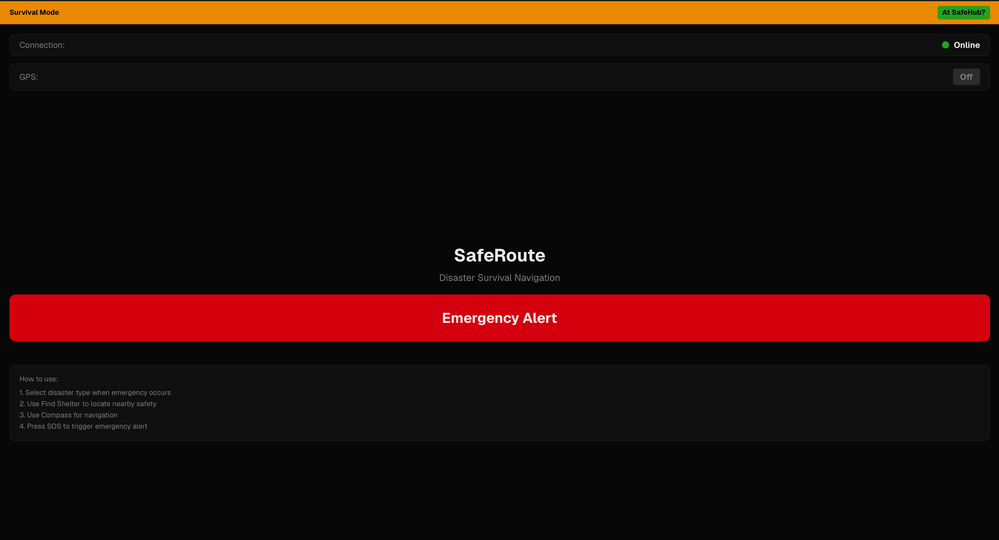
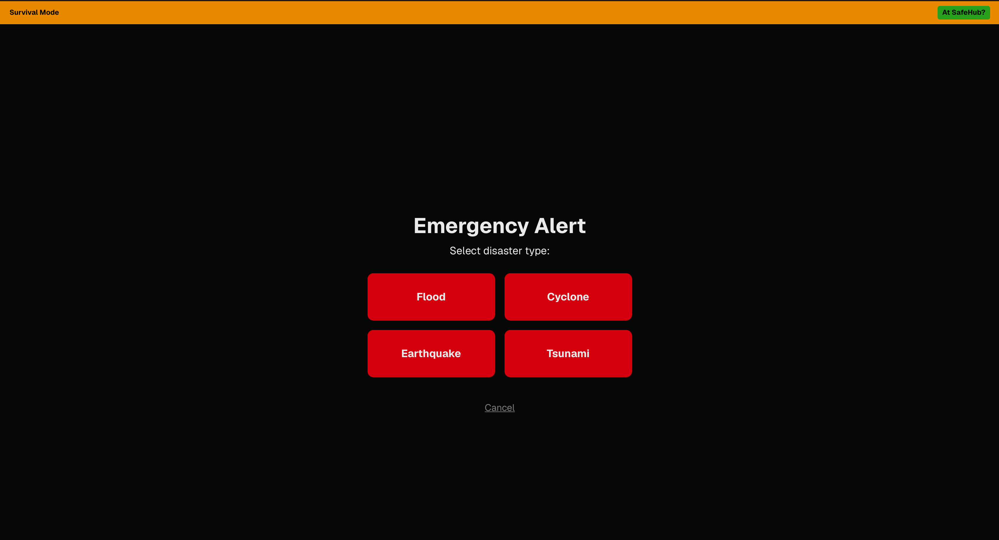
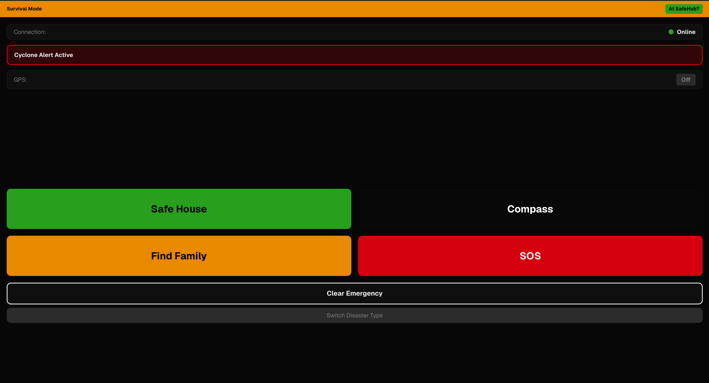
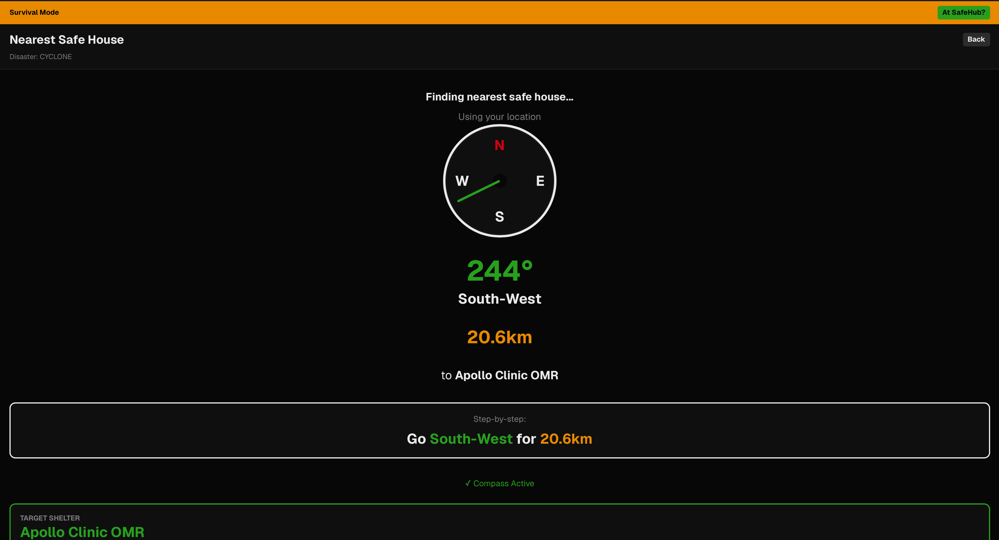
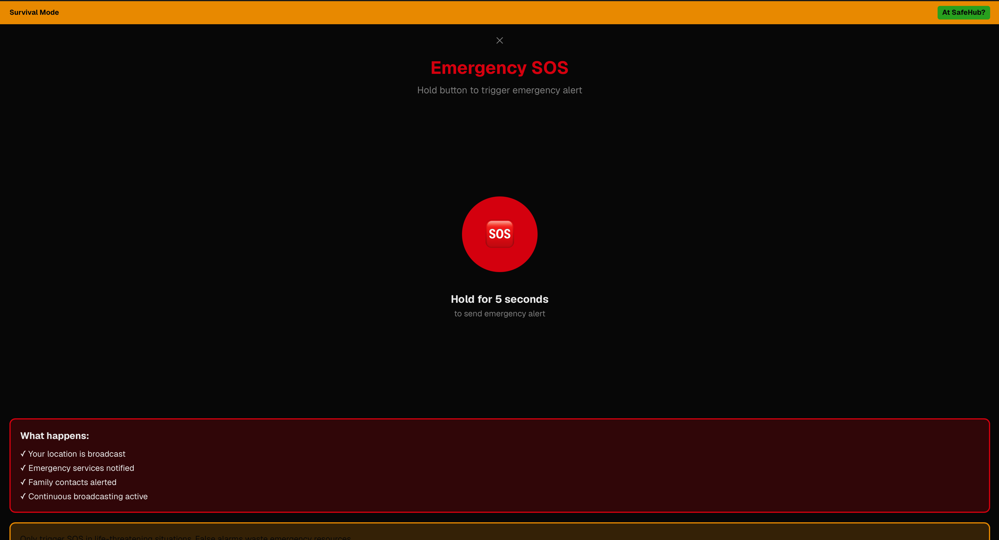

<div align="center">

# SafeRoute

### Disaster Survival Navigation — Designed for Failure

**An emergency-focused Progressive Web App designed to help survivors navigate to safety, locate nearby safe houses, find family members, and trigger emergency assistance when conventional communication or normal phone interaction may become unreliable.**

<br>

<a href="https://v0-safe-route-pwa-frontend.vercel.app/">
  
</a>

<a href="https://github.com/hadexcode-collab/SAFEROUTE-FRONTEND">
  
</a>

<br><br>



</div>

---

# What is SafeRoute?

SafeRoute is an emergency-focused Progressive Web App designed around one core idea:

> **During a disaster, the phone itself may become part of the problem.**

Cellular networks can fail. Screens can crack. Touchscreen areas can become unusable. Users may be under extreme stress and may not have the time or ability to navigate through a conventional application.

SafeRoute is designed around these failure conditions.

The system focuses on providing a simple emergency workflow for:

- Finding safe destinations
- Navigating toward safety
- Locating family members
- Triggering emergency assistance
- Operating through a high-contrast interface
- Preparing for communication beyond conventional cellular infrastructure

---

# What SafeRoute Does

SafeRoute provides a focused emergency workflow instead of a conventional navigation interface.

A survivor can:

- Select the type of disaster
- Locate a nearby safe house
- Receive directional guidance using a compass
- Find family members
- Trigger an emergency SOS
- Use a high-contrast, simplified interface
- Connect to an external RF communication system when cellular infrastructure is unavailable

### Supported Disaster Modes

**Flood · Cyclone · Earthquake · Tsunami**

---

# Survival Mode

The main interface keeps essential emergency information and actions immediately accessible without forcing the survivor through complicated menus.

<p align="center">
  
</p>

The interface deliberately uses a high-contrast visual system:

| Color | Purpose |
|---|---|
| 🔴 **Red** | Danger, emergency and SOS |
| 🟢 **Green** | Safe destination and navigation |
| 🟠 **Orange** | Warnings and emergency selection |
| ⚫ **Black + high contrast** | Reduced visual clutter and improved visibility |

The objective is not simply visual style.

The interface is designed to remain readable and actionable under poor visibility and damaged-screen conditions.

---

# Emergency Workflow

When an emergency occurs, the survivor first selects the appropriate disaster type.

<p align="center">
  
</p>

The disaster selection screen intentionally contains only the essential choices.

This reduces the number of interactions required when the user is under stress.

---

## Emergency Dashboard

After selecting a disaster, SafeRoute enters the corresponding emergency mode.

<p align="center">
  
</p>

The dashboard provides direct access to the most important emergency functions:

- **Safe House**
- **Find Family**
- **Compass**
- **SOS**
- Emergency status
- Disaster switching / emergency reset

The design principle is simple:

> **The survivor should not have to search through an application to find an emergency function.**

---

# Safe House Navigation

SafeRoute can identify a nearby safe destination and provide directional guidance toward it.

<p align="center">
  
</p>

The navigation interface communicates the information a survivor needs immediately:

- Direction
- Compass bearing
- Distance
- Target safe house
- Step-by-step directional guidance
- Compass status

Instead of presenting a visually complicated map as the primary interface, SafeRoute emphasizes the next physical action:

> **Which direction should I go, and how far?**

---

# Emergency SOS

The SOS interface is intentionally separated from normal application interactions.

<p align="center">
  
</p>

SafeRoute uses a **press-and-hold interaction** for SOS rather than a single tap.

This helps reduce accidental emergency activation.

The broader SafeRoute system is designed to support emergency actions such as:

- Survivor location transmission
- Emergency alert generation
- Family notification
- Continued emergency communication

The exact communication behavior depends on the communication infrastructure connected to the system.

---

# Designed for a Damaged Phone

One of the key design requirements of SafeRoute is **interaction resilience**.

A disaster does not guarantee that the phone will remain fully functional.

The screen may be:

- Cracked
- Partially unresponsive
- Difficult to see
- Damaged around the edges

SafeRoute therefore uses deliberately oversized controls, generous spacing, and strong visual separation.

## Edge-Safe Controls

Important controls are positioned away from vulnerable screen edges wherever possible.

## Large Touch Targets

Critical actions occupy large areas of the interface to reduce missed presses and accidental interaction.

## High Visual Separation

Emergency states use strong color and layout changes instead of relying only on small text.

## Minimal Interaction Paths

Critical workflows are intentionally short:

```text
Emergency
    ↓
Disaster Type
    ↓
Safe House
    ↓
Navigation / SOS
```

---

# Physical Interaction

The broader SafeRoute system is designed to support physical device controls when touchscreen interaction becomes unavailable.

A possible interaction model is:

```text
Volume Up       → Next / Navigate

Volume Down     → Previous / Back

Action Button   → Emergency Interaction
```

The exact implementation depends on the Android/device layer.

> **Note:** Physical-button integration belongs to the broader hardware/device implementation and is not entirely contained inside this frontend repository.

---

# Communication Beyond Cellular Networks

A disaster may cause cellular infrastructure to become unavailable.

SafeRoute is therefore designed with the possibility of connecting the phone to an **external RF communication module**.

Conceptually:

```text
┌──────────────────────┐
│        PHONE         │
│      SafeRoute       │
└──────────┬───────────┘
           │
           │ Plug-and-Play
           ▼
┌──────────────────────┐
│      RF MODULE       │
│ Communication Layer  │
└──────────┬───────────┘
           │
           │ Radio Communication
           ▼
┌──────────────────────┐
│   Nearby RF Nodes    │
│ / Emergency Network  │
└──────────────────────┘
```

This architecture is intended to provide an alternative communication path when conventional cellular infrastructure is unavailable.

> **Important:** The RF hardware is part of the broader SafeRoute system. This repository primarily contains the survivor-facing frontend.

---

# System Architecture

SafeRoute can be viewed as multiple interconnected layers:

```text
                    ┌───────────────────────┐
                    │      SafeRoute        │
                    │      Frontend         │
                    │                       │
                    │ Safe House • Compass  │
                    │ Family • SOS         │
                    └───────────┬───────────┘
                                │
                                ▼
                    ┌───────────────────────┐
                    │   Communication       │
                    │       Layer           │
                    │                       │
                    │ Cellular / RF / Mesh  │
                    └───────────┬───────────┘
                                │
                                ▼
                    ┌───────────────────────┐
                    │   Emergency Backend   │
                    │                       │
                    │ Alerts • Coordination │
                    │ Survivor Status       │
                    └───────────┬───────────┘
                                │
                                ▼
                    ┌───────────────────────┐
                    │ Shelter & Location    │
                    │       Services        │
                    └───────────────────────┘
```

This repository primarily contains the **survivor-facing frontend application**.

---

# Installation & Setup

Follow the steps below to run SafeRoute locally.

## Prerequisites

Make sure the following are installed on your system:

- **Git**
- **Node.js**
- **pnpm**

Verify your installations:

```bash
git --version
node --version
pnpm --version
```

If each command returns a version number, your environment is ready.

---

## 1. Clone the Repository

Clone the SafeRoute frontend repository:

```bash
git clone https://github.com/hadexcode-collab/SAFEROUTE-FRONTEND.git
```

This downloads the SafeRoute source code to your local machine.

---

## 2. Navigate to the Project

Move into the project directory:

```bash
cd SAFEROUTE-FRONTEND
```

All following commands should be executed from inside this directory.

---

## 3. Install Dependencies

Install the project's required dependencies:

```bash
pnpm install
```

This installs the packages defined in the project's `package.json` and uses the lockfile to maintain consistent dependency versions.

---

## 4. Start the Development Server

Start SafeRoute in development mode:

```bash
pnpm dev
```

The development server should start locally.

You should see an address similar to:

```text
http://localhost:3000
```

---

## 5. Open SafeRoute

Open your browser and visit:

```text
http://localhost:3000
```

SafeRoute should now be running locally.

---

# Quick Start

If Git, Node.js, and pnpm are already installed, the complete setup can be performed with:

```bash
git clone https://github.com/hadexcode-collab/SAFEROUTE-FRONTEND.git
cd SAFEROUTE-FRONTEND
pnpm install
pnpm dev
```

Then open:

```text
http://localhost:3000
```

---

# Development

Start the development server with:

```bash
pnpm dev
```

The development environment supports hot reloading, allowing changes made to the source code to be reflected in the browser during development.

To stop the development server:

```text
Ctrl + C
```

---

# Production Build

Create an optimized production build:

```bash
pnpm build
```

After the build completes, start the production server:

```bash
pnpm start
```

---

# Project Structure

```text
SAFEROUTE-FRONTEND/
│
├── app/                  # Application pages and routes
├── components/           # Reusable UI components
├── hooks/                # Custom React hooks
├── lib/                  # Application logic and utilities
├── public/               # Static assets
├── styles/               # Global styling
│
├── assets/               # README screenshots
│   ├── 01-home.png
│   ├── 02-disaster-selection.png
│   ├── 03-emergency-dashboard.png
│   ├── 04-safe-house-navigation.png
│   └── 05-emergency-sos.png
│
├── COMPASS_INTEGRATION.md
├── SAFEHOUSE_SYSTEM.md
├── SAFEHUB_IMPLEMENTATION.md
├── SAFEROUTE_REQUIREMENTS_CHECKLIST.md
│
├── package.json
├── pnpm-lock.yaml
├── next.config.mjs
├── tsconfig.json
└── README.md
```

---

# Technology Stack

| Technology | Purpose |
|---|---|
| **Next.js** | Application framework |
| **React** | User interface |
| **TypeScript** | Type-safe development |
| **Tailwind CSS** | Interface styling |
| **PWA** | App-like web experience |
| **pnpm** | Package management |

---

# Technical Documentation

Additional implementation details are available inside the repository:

- [Compass Integration](./COMPASS_INTEGRATION.md)
- [Safe House System](./SAFEHOUSE_SYSTEM.md)
- [Safe Hub Implementation](./SAFEHUB_IMPLEMENTATION.md)
- [SafeRoute Requirements Checklist](./SAFEROUTE_REQUIREMENTS_CHECKLIST.md)

---

# Roadmap

## Emergency Experience

- [x] Disaster selection
- [x] Emergency dashboard
- [x] Safe House interface
- [x] Compass navigation interface
- [x] Emergency SOS
- [x] High-contrast emergency UI

## Communication

- [ ] External RF module integration
- [ ] RF / mesh communication layer
- [ ] SMS fallback
- [ ] Offline communication synchronization

## Emergency Coordination

- [ ] Family coordination backend
- [ ] Real-time shelter availability
- [ ] Survivor status synchronization
- [ ] Emergency response dashboard

## Hardware Integration

- [ ] Dedicated Android hardware-button integration
- [ ] Expanded offline data support
- [ ] Device-level emergency integration

---

# Contributing

Contributions, ideas, and technical feedback are welcome.

## Create a Feature Branch

```bash
git checkout -b feature/your-feature
```

## Make Your Changes

Implement and test your changes locally.

## Commit Your Changes

```bash
git add .
git commit -m "feat: describe your change"
```

## Push Your Branch

```bash
git push origin feature/your-feature
```

Then open a Pull Request.

For major architectural changes, consider opening an issue first to discuss the proposed implementation.

---

# Security

Do not commit sensitive information such as:

- API keys
- Access tokens
- Private credentials
- Environment secrets
- Personal user data

Use environment variables and secure deployment configuration when working with external services.

---

# Author

<div align="center">

### AVINASH TT

**Computer Science Engineering**  
Sathyabama Institute of Science and Technology

Artificial Intelligence · Robotics · Emergency Technology · Full-Stack Systems

<br>

<a href="https://github.com/hadexcode-collab">
  
</a>

</div>

---

# License

This project is developed for **educational, research, and prototyping purposes**.

---

<div align="center">

### SafeRoute

**Technology designed for the moment when normal systems fail.**

</div>
